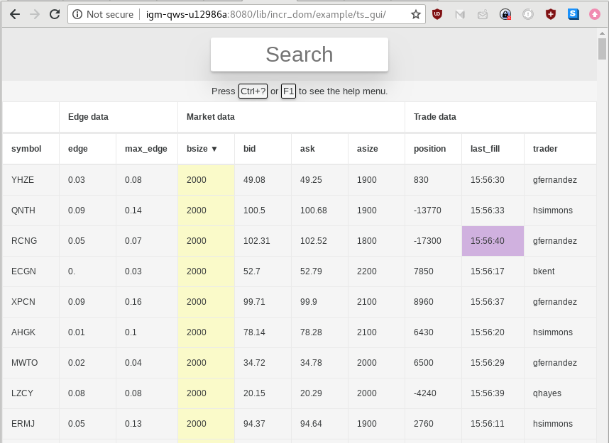
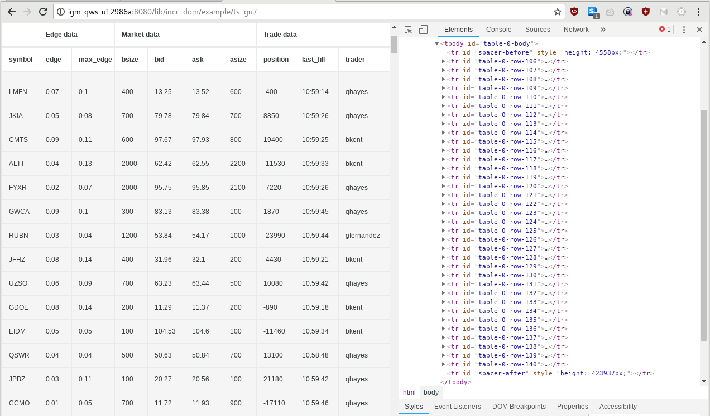

A mockup of a (very) simple trading-system GUI.

## What does the application actually do?

Ts\_gui is a tabular application that's meant to simulate the GUI for
a trading system:

[](https://user-images.githubusercontent.com/21294/41180439-459fb448-6b3c-11e8-88a1-8b04bc7f4252.gif)

(Click the image above for a short clip of the app in action.)

You can get it running yourself by following the instructions on [this
page](../README.org) ("Running the examples").

There's a lot going on in this relatively simple interface, and it's
worth unpacking before we dive into the code. That way we'll have a
sense of what all the code is actually for. Here are some highlights:

- The UI displays lots of rows (10,000 by default) but without rendering the
  ones that are offscreen. For this it uses the `Table` widget, which
  is built on `Partial_render_list` to do the intelligent partial rendering.
- Certain cells update from time to time, and some of them flash
  purple when they do. The data is all fake, and is generated
  client-side (i.e., the web page isn't calling out to a server to get
  new values).
- You can change which cell is "focused," which highlights that cell in green
  and its corresponding row in blue.
- You can edit certain cells in the focused row, though your changes
  don't persist over page reloads.
- There are keyboard shortcuts for these operations (focusing rows,
  navigating within a row, editing & committing edits to cells, etc.).
- There is a help menu that shows all the available keyboard shortcuts.
- You can search the table to filter it. The filtering happens as you type.
- You can sort by one column at a time, in either direction.

## How is the code organized?

There are six important files:

- **import.ml**. The app is built on top of a few `Incr_dom_widgets`,
  most importantly `Ts_table`, which are imported by this file.

- **app.ml{,i}**. The bulk of the overall application logic --
  `Model`, `Action`, `State`, `view` -- lives here.

- **row.ml{,i}**. You can think of each row as a mini-app with its own
  model and view, specified in this file. A row has many columns,
  which are defined next.

- **column.ml{,i}**. A helper module for setting up `Ts_table.Column`s
  for a given row.

- **time.ml**. A few helper functions for rendering the current time
  to string, which is slightly awkward in `Incr_dom` (see the remarks
  on `Time_ns.t` in the FAQ on [this page](../../../../doc/webdev/guide.org)).

- **main.ml**. Initializes the app using `Start_app.derived`.

## What makes this app more sophisticated than `Text_input`?

Part of the reason this app is worth exploring in some more detail is
that it makes use of many of the features of Incr\_dom that were
shrugged off in the `Text_input` example. In particular...

**It uses a `Derived_model`**

In *main.ml* we initialize the app with
[`Start_app.derived`](http://ocaml-docs/incr_dom/Incr_dom/Start_app/index.html#val-derived)
instead of the more typical `Start_app.simple`. This means we're
declaring our app to be using the
[`S_derived`](http://ocaml-docs/incr_dom/Incr_dom/App_intf/module-type-S_derived/index.html)
interface instead of the `S_simple` interface.

The main thing `S_derived` adds above and beyond `S_simple` is the
notion of a
[`Derived_model`](http://ocaml-docs/incr_dom/Incr_dom/App_intf/module-type-S_derived/Derived_model/index.html).

The point of a derived model is to allow the computation of the action
to use some information that was computed incrementally, rather than
doing it in an all at once manner. At the same time, the derived model
is also accessible when computing the view, allowing sharing of some
of the incremental computation between the action and the view.

For example, the `Ts_table` widget, which this app imports (more on
that below), makes use of a derived model to power the ability to
"move focus to the next row." This turns out to be a more complicated
operation than you might expect, because it depends on which rows have
been filtered out by a search and on how they've been sorted. What's
more, both `apply_action` and `view` need access to this
information. Since it would be costly to replicate the entire
computation, we use a derived model instead, which is generated via an
incremental computation in a way that is shared by the view function and
the action interpretation code.

The way it works is that in the `Ts_table` widget's `Derived_model`
module, there's a `create` function that is passed the original model
`m`. This function's job is to make a series of refinements to the
original model, which it can then use to build new
incremental values, which are returned as a new mini-model (the
derived model). We can see this in action by looking at a
heavily-excerpted version of the `Ts_table.Derived_model`:

```ocaml
module Derived_model = struct
  type 'a t =
    { [...]
    ; floating_col : Column_id.t option
    } [@@deriving fields]
  
  let create m ~rows ~(columns : (Column_id.t * _ Column.t) list Incr.t) =
    [...]
    let floating_col =
      let%map float_first_col = m >>| Model.float_first_col
      and columns = columns
      in
      if Float_type.is_floating float_first_col
      then (Option.map (List.hd columns) ~f:fst)
      else None
    in
    let%map floating_col = floating_col
    and [...]
    in
    { [...]
    ; floating_col
    }
  ;;
end
```

Later, in the widget's `view` function, we depend in certain places
not on the model, but on this derived model, like so:

```ocaml
(* [d] is the derived model *)
let columns = d >>| Derived_model.columns in
```

**It uses widgets**

The [`Incr_dom_widgets`](../../../incr_dom_widgets/README.org) library
provides reusable "widgets" that can be plugged into web apps. Most of
the widgets we've developed so far have to do with processing tabular
data, but you could imagine all kinds of reusable components -- for
instance, for picking dates or validating forms.

Once you've used Incr\_dom, widgets are easy to understand because
they implement the same interface. In fact each widget is essentially
just its own Incr\_dom app, with a model, actions, and view. You use
them simply by referring to these parts in the corresponding place in
your own app.

(The difference is that most widgets depend on the app that includes
them to provide certain key parts of the model and view. In other
words, most widgets wouldn't work as a standalone app.)

**It uses `State` and `schedule`**


The `on_startup` function in the Text\_input app was a no-op. Here,
though, we use it to kick off an async process that creates a "big
kick" (a simulated price move) in the app every 50ms:

```ocaml
let on_startup ~schedule (m:Model.t) (_:Derived_model.t) =
  let state = { State.schedule } in
  let open Async_kernel in
  let ids = Map.keys m.rows |> Array.of_list in
  every (Time_ns.Span.of_ms 50.) (fun () -> State.schedule state (Big_kick ids));
  return state
```

In more sophisticated apps, this kind of async process might actually
hit an external server, but either way the principle is the same: We
have a handle to the `Model`, which lets us feed the current state of
the app into our async process; and a handle to `State`, which lets us
feed the results of the async process back into the model.

That is the whole point of `State`: it exposes a `schedule` function
from `Action.t -> unit` that an external process can call anytime it
wants to update the model (by triggering an action).

**It uses `on_display`**

Recall that `on_display` fires anytime the DOM is updated. It's used
to respond to the view-changing side effects of model changes. Here,
we use it to check whether the focus has moved to a cell that's no
longer in view, say because the user cleared their search and the
focused row was pushed down below rows that are newly unfiltered. If
so, we scroll the page to put the row back into view.

(This functionality is provided mostly by the `Ts_table` widget.)

**It uses `update_visibility`**

We don't want to render rows that are offscreen, especially when there
are 10,000 of them. The `update_visibility` function allows us to
achieve this. It's called whenever the page is
[reflowed](https://developers.google.com/speed/docs/insights/browser-reflow),
and includes a hook to the model (and derived model). We can inspect
the model, and use information about what *should* be rendered to
selectively render just those rows that are still visible -- say,
after a user scrolls.

Just using the Ts\_gui app, you might not believe that partial
rendering is actually working, since it feels like you can scroll
smoothly through the 10,000 rows. But you can see it vividly if you
look at the Chrome inspector:



Notice that the scrollbar makes it look as though there are thousands
more rows. And indeed when we scroll, it's as if those rows were
already there. But they are generated on the fly. In the "Elements"
panel on the right-hand side of the screen, you can see that there are
only 35 actual `<tr>` elements. As you scroll down, row 106 will drop
off while row 141 will be created, and so on.

The number 35 isn't magic or hard-coded anywhere -- the
`Partial_render_list` widget, which `Ts_table` depends on, calculates
the height of each individual element (row) in the container, and uses
that to calculate how many rows should be visible.

This calculation is kicked off in the `update_visibility` function:

```ocaml
let update_visibility (m:Model.t) (d:Derived_model.t) ~recompute_derived:_ =
  let table = Ts_table.update_visibility m.table d.table in
  {m with table}
```

Like many functions in the Ts\_gui app, this one just delegates to the
corresponding function in `Ts_table`, where the actual work happens:

```ocaml
let update_visibility (m : Model.t) d =
  let visibility_info      = update_visibility_info      m d in
  let height_cache         = update_height_cache         m d in
  let col_group_row_height = update_col_group_row_height m d in
  if [%compare.equal: Visibility_info.t option] visibility_info m.visibility_info
  && [%compare.equal: Row_view.Height_cache.t] height_cache m.height_cache
  && [%compare.equal: int] col_group_row_height m.col_group_row_height
  then m
  else { m with visibility_info; height_cache; col_group_row_height }
```

The `update_height_cache` function does the actual calculation:

```ocaml
(** Computes and updates the heights of all rows that are currently rendered *)
let update_height_cache (m : Model.t) (d : _ Derived_model.t) =
  Row_view.measure_heights
    d.row_view
    ~measure_row:(fun key ->
      Option.map (find_row_element m.id key.row_id) ~f:(fun el ->
        let rect = Js_misc.viewport_rect_of_element el in
        Js_misc.Rect.top rect, Js_misc.Rect.bottom rect
      )
    )
    ~get_row_height:(fun ~prev ~curr ~next ->
      [...]
    )
```

`Row_view` is just an alias for our `Partial_render_list`:

```ocaml
module Row_view = Partial_render_list.Make(Key)
```

In short, the ability to partially render rows comes from
`Partial_render_list`, via the `Ts_table` widget, which is invoked
(among other places) every time we `update_visibility` -- which
happens more or less constantly as we use the app or update the model
(like anytime new "trading data" comes in, every 50ms).
